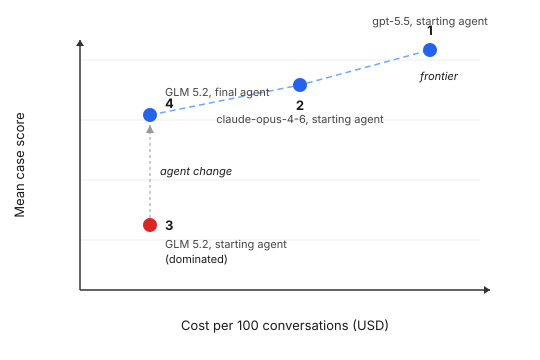

# Homework 8, improving accuracy and establishing a Pareto frontier

## Work through the assignment with a coding agent

Paste this prompt at the start of a coding agent session in your repository:

> Guide me through Homework 8 in `homework/module-5/hw8.md`, one part at a time. Read `AGENTS.md`, the handout, the files in `optimize/`, and my Homework 5 and Homework 6 artifacts before changing files. Never edit `eval_cases/`, `tests/`, `analysis/state/judges/`, or `optimize/state/`, and never run a test case before I save the final agent configuration. Before any paid run, show me the model, the number of evaluated case runs, and the number of judge calls, then wait for my approval. Never print or commit secret values. Leave the choice of failure mode, the final selection, and the video to me.

Homework 8 asks you to fix one recurring Cartwheel failure, then compare agent configurations by accuracy and cost on a held out test set.

An **agent configuration** is one exact combination of code, prompt, and model. A **candidate** is an agent configuration under consideration. You will make changes using a development set of cases, then compare configurations on a separate test set that did not guide the changes.

## Expected work

- Estimated time: 4 to 6 hours.
- Required model access: three models that can use the Cartwheel tools. You may use the supplied defaults or select other models.
- Automated search limit: 150 evaluated case runs.

An **evaluated case run** means running one evaluation case once and scoring the result. A case that expects the agent to change data runs five times, because one successful run does not establish reliable action behavior. The share of data-changing cases that passed all five runs is called **`write_pass_5`**. Manual experiments do not use the automated search budget, but every GEPA or improve loop run does.

## Preparation

Run every command from the repository root. Homework 8 uses the evaluation cases from Homework 6 and the judges you accepted in Homework 5. Do not edit the judges or evaluation cases.

Confirm that `.env` contains the keys for your selected models and judges. The supplied model choices use `OPENAI_API_KEY`, `ANTHROPIC_API_KEY`, and `TOGETHER_API_KEY`.

```bash
uv sync
```

Confirm that the earlier work is present:

```bash
wc -l eval_cases/cases.jsonl
grep -c '"kind": "regression"' eval_cases/cases.jsonl
grep -c '"kind": "capability"' eval_cases/cases.jsonl
```

Homework 8 needs at least six evaluation cases, including at least two regression cases and two capability cases, so that both the development set and the test set contain each kind. Homework 6 required at least one of each. When you have fewer, add cases and classify them with five baseline runs, as in Homework 6, before continuing.

If you did not finish Homework 6, apply the reference cases:

```bash
git apply homework/module-5/hw8-reference-cases.patch
```

If you did not accept a judge in Homework 5, use cases scored only by code checks, or the reference `unsupported_policy_claim` judge included in the starter.

Open `optimize/config.json`, then select the models you want to use:

```json
{
  "price_date": "REPLACE_WITH_YYYY-MM-DD",
  "models": {
    "development_and_search": "glm-5.2",
    "comparison": ["gpt-5.5", "claude-opus-4-6", "glm-5.2"],
    "gepa_reflection": "anthropic/claude-opus-4-6"
  },
  "prices_per_million_tokens_usd": {
    "claude-opus-4-6": {"input": null, "output": null},
    "glm-5.2": {"input": null, "output": null},
    "gpt-5.5": {"input": null, "output": null}
  }
}
```

`development_and_search` is the model used for every manual change and the automated search. `comparison` contains three different models used in the final comparison, and its third model must match `development_and_search`. The supplied choices are GLM 5.2 for development, with `gpt-5.5`, `claude-opus-4-6`, and GLM 5.2 in the final comparison.

You may replace any supplied model with another model that can use the Cartwheel tools. Keep the same selected development model throughout the homework, and record every selected model in `optimize/config.json` before creating the case split. `gepa_reflection` is used only when you choose GEPA in Part D; you may leave the supplied value or change it.

Enter the current input and output token prices for every selected comparison model from the model's pricing page. Add a price entry when you choose a model that is not already listed. Record the date when you checked the prices in `price_date`. The final comparison uses one price date, because mixing prices from different dates would make the cost rows hard to compare.

Check that every selected model can finish one case. The check does not use the search budget:

```bash
uv run python -m optimize.check_models
```

Replace any model the check reports, because the model selection cannot change after the next step.

Create the fixed case split and the automated search budget:

```bash
uv run python -m optimize.prepare
```

The command places about one third of the regression cases and one third of the capability cases in the test set, and the rest in the development set, in `optimize/state/split.json`. With 30 cases, the result is 20 development cases and 10 test cases; with the reference cases, it is 6 and 4. The file stores case identifiers, not duplicate case text. The command also creates `optimize/state/search_budget.json`, which begins with 150 available evaluated case runs.

Commit `optimize/config.json` and both state files before changing the agent. Do not delete, recreate, or edit the split or budget after the first preparation run.

## Part A, choose one failure mode to fix

Choose the highest prevalence failure in your Homework 5 failure report that can be addressed in the prompt, tools, or harness, and that at least one development case scores.

Create `optimize/results/target.json` with the following fields:

```json
{
  "failure_mode": "unsupported_policy_claim",
  "source": "Homework 5 failure report",
  "prevalence": 0.0,
  "requirement": "RESP-1",
  "example_trace_ids": ["TRACE_1", "TRACE_2", "TRACE_3"],
  "why_agent_can_change_it": "A short explanation tied to the three examples."
}
```

The three trace identifiers are evidence that the selected behavior occurred, and each trace should show the part of the run that supports the label.
If you use the reference judge, set `prevalence` to the share of `store_predictions` it labeled fail in `analysis/state/judges/unsupported_policy_claim-v3.json`, and use three of those trace identifiers.

## Part B, record the starting result

Commit all work completed so far, then run the unchanged starting agent configuration on the development cases with your selected development model:

```bash
uv run python -m optimize.runner --split development --candidate starting
uv run python -m optimize.save_version starting
```

`optimize.runner --split development` runs the development cases without charging the search budget. It reports the mean case score, `write_pass_5`, cost per 100 conversations, and median response time, and saves the result in `optimize/results/` and in `optimize/results/latest-development.json`. Each result lists every run's reply, failed checks, and judge reasons under `run_details`. Cost covers the agent's model calls but excludes judge calls.

`optimize.save_version starting` locks the exact Git commit, prompt hash, and scores in `optimize/state/starting_version.json`. Commit the starting record before trying a change.

## Part C, try one manual change at each layer

Design one prompt change, one tool change, and one harness change to learn which layer fixes the failure most directly.

### 1. Identify the three layers

- A prompt change edits `SYSTEM_PROMPT_TEMPLATE` in `agent/agent.py`.
- A tool change edits a tool's description in `agent/agent.py` or its code and result in `agent/tools.py`.
- A harness change edits retrieval, step control, context construction, or result verification outside the tool itself.

Do not weaken the permission checks in `agent/auth.py`.

### 2. Test each change against the development cases

Before editing each layer, add the predicted effect to `optimize/results/manual.csv`. Apply and commit one change, run the command below, and then keep or revert the change before moving to the next layer. Commit only the agent files, and revert with `git checkout <previous commit> -- agent/`:

```bash
uv run python -m optimize.runner --split development --candidate SHORT_NAME
```

In your real applications, use more development cases and rerun a promising change before keeping it, since with few cases a one-case difference is often noise.

### 3. Record the results

Use one row per result in `optimize/results/manual.csv`:

```text
candidate,layer,predicted_effect,dev_score,write_pass_5,cost_per_100_conversations_usd,decision,git_commit,result_file
starting_version,...
prompt_change,...
tool_change,...
harness_change,...
```

Copy the Part B starting result into the first row. Use `keep` or `revert` in `decision`, and keep a row even when a change made the result worse.

## Part D, run one automated improvement method

### 1. Choose a method

- Choose **GEPA** when prompt wording is the likely place for the fix. GEPA proposes prompt revisions from failed checks and judge results.
- Choose the supplied **improve loop skill** when the likely fix may be in one prompt, tool, or harness file. The skill guides a coding agent through one allowed change at a time.

Both methods can use only the development case identifiers in `optimize/state/split.json`. Neither method may run a test case, inspect a test case result, edit an evaluation case, edit a test, or edit a saved Homework 5 judge. `optimize/allowlist.txt` names the agent files available to the improve loop.

### 2. Run GEPA

Install the optional dependency, run the smoke test, and then run the supplied adapter:

```bash
uv sync --extra optimization
uv run python -m optimize.gepa_adapter --smoke
uv run python -m optimize.gepa_adapter
```

The smoke test runs one development case for a few evaluations, does not charge the budget, and confirms that your task and reflection models are reachable.

Add `--max-runs N` to stop sooner; if GEPA stops early, run the same command again to resume.

The adapter runs the Cartwheel agent with the development model and uses the GEPA reflection model to propose prompt revisions. Every evaluated case run counts against the 150 run budget. The adapter stops when the budget is exhausted or when no further improvement is found. It writes the history to `optimize/results/gepa-result.json` and the best prompt to `optimize/results/gepa-best-prompt.txt`. Copy the selected text into `SYSTEM_PROMPT_TEMPLATE`. The GEPA search score and the score from rerunning the same prompt with `optimize.runner` will not match exactly, because the agent's behavior varies between runs; use the rerun score.

### 3. Run the improve loop

Ask your coding agent to use `.agents/skills/improve-loop/SKILL.md`, a general autoresearch loop, with `optimize/program.md` as its Cartwheel setup. We have already written `optimize/program.md` for you; to practice writing it yourself, delete it, rename `optimize/program_skeleton.md` to `optimize/program.md`, and fill it in. Note that this step is totally optional. The skill runs the following budgeted command after each proposed change:

```bash
uv run python -m optimize.runner --split development --candidate SHORT_NAME --search
```

Adding `--search` charges every evaluated case run to the 150 run budget, and the command refuses a run that would exceed the remaining allowance. The skill records every candidate in `optimize/results/improve-loop.jsonl`, including the changed files, rationale, score, decision, and saved result. It stops after two consecutive candidates fail to improve the development score, or when no budget remains.

The 150 run budget is a maximum, and you do not need to use all of it.

### 4. Commit the records

Commit the automated search records, including `optimize/state/search_budget.json`, the dated development results, and either `gepa-result.json` or `improve-loop.jsonl`. The records must make every proposed candidate, score, and decision recoverable.

## Part E, save the final agent configuration

Choose the candidate that best addresses the Part A failure mode, then break ties with development score and `write_pass_5`. The final candidate does not need the highest mean score, e.g., a candidate that fixes the target failure mode and raises `write_pass_5` may be worth a small drop in mean score. Explain your reasoning in the video. Apply the candidate, commit, and rerun:

```bash
uv run python -m optimize.runner --split development --candidate final
uv run python -m optimize.save_version final --layer LAYER --method METHOD
```

Replace `LAYER` with `prompt`, `tool`, or `harness`, and replace `METHOD` with `manual`, `gepa`, or `improve-loop`. Repeat `--layer` or `--method` when the selected candidate combines more than one.

Save the final configuration before seeing the test results, or your work may be prone to leakage and overfitting. The command verifies that the scoring rules have not changed since preparation. Commit `optimize/state/final_version.json` after the command succeeds.

## Part F, compare four configurations on the test set

Create the plan for the four configurations:

```bash
uv run python -m optimize.frontier plan
```

The plan contains the following configurations:

| Configuration | Agent code and prompt | Model |
| --- | --- | --- |
| 1 | Starting agent configuration | First selected comparison model |
| 2 | Starting agent configuration | Second selected comparison model |
| 3 | Starting agent configuration | Selected development model |
| 4 | Final agent configuration | Selected development model |

Configurations 1 through 3 differ only by model, so their results show the effect of changing the model. Configurations 3 and 4 use the same model, so their results show the effect of the selected agent changes.

Review `optimize/state/test_plan.json`, confirm that every commit and model is correct, and then run the planned batch once:

```bash
uv run python -m optimize.frontier run
```

The command checks out each recorded commit in a temporary working copy, runs the test cases, and writes `optimize/results/frontier.csv`. If the LLM API disconnects, run `uv run python -m optimize.frontier run` again to resume.

The table marks a configuration as **dominated** when another configuration has an equal or higher score and an equal or lower cost, with at least one strict improvement. A configuration that is not dominated belongs to the measured **frontier**, which is the set of configurations that still represent a useful accuracy and cost tradeoff.



The figure above uses hypothetical data. Configuration 4 dominates configuration 3 because the agent change raised the score without raising the cost. Configurations 1, 2, and 4 remain on the frontier because each offers a different accuracy and cost tradeoff. Your results will have different values.

Do not change the final agent configuration after reading the test results. A later improvement would require a new test set, because the current test cases have become part of the development knowledge.

## Video

Record one continuous screen video of no more than 5 minutes that walks through your experiment, from the failure mode you chose to the test set comparison, and regenerate one committed number on camera.

## Optional exercise, package one development case for Harbor

After committing the required homework, you may use LangChain's `eval-engineering` skill to package one development case as a Harbor task. A Harbor task combines an agent request, its starting environment, and the rule used to decide whether the agent passed.

Use a development case only, preserve the existing request and scoring rule, and compare Harbor's pass or fail result with the Cartwheel result for the same case. The exercise is not graded and does not belong in the video.
